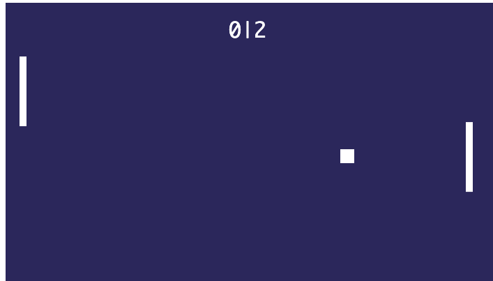

# JSPong
Simple pong game built with HTML, CSS and vannila JavaScript
Current features
- Single player mode: play against a computer controlled paddle
- Score tracking: Track your and the computer's score
- Smooth animations with Canvas.js
- In game sound effects

Upcoming features
- Online Multiplayer version with a flask server

## Developer
Nahom Teshome

